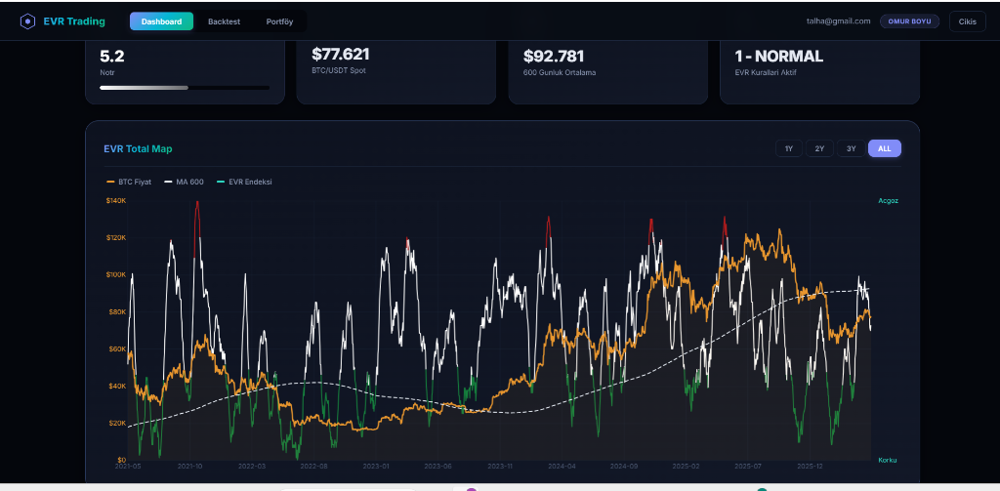
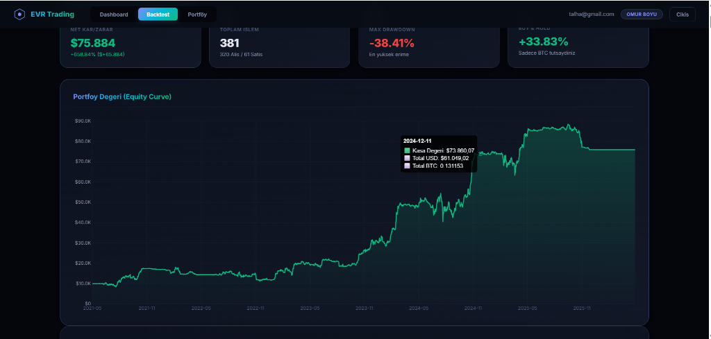

# EVR-BOT: KMFG Extreme Volatility Ratio Trading Bot

A fully autonomous, containerized macro swing-trading bot for Spot BTC/USDT that uses KMQuant's EVR (Extreme Volatility Ratio) sentiment index to buy market bottoms and sell tops, protected by a 600-day Simple Moving Average (MA600) trend shield to preserve capital during long-term bear markets.

## Problem
What user/business problem does this solve?
- **Emotional Decision-Making**: Retail cryptocurrency traders frequently suffer from fear and greed, buying tops (FOMO) and selling bottoms (Panic Selling).
- **Macro Trend Recognition**: Detecting long-term macro trend shifts manually is challenging. Traditional short-term indicators generate excessive noise and lead to over-trading.
- **Severe Drawdown Risk**: Prolonged bear markets can lead to massive portfolio drawdowns. Standard spot-trading bots lack long-term capital preservation mechanisms (like a "Shield") and lose value during multi-month downward spirals.
- **Evasion & Scraping Challenges**: Accessing proprietary macro metrics (like KMQuant's EVR index) requires scraping platforms protected by aggressive anti-bot guards (Cloudflare Turnstile), which is highly prone to blocking standard request tools.

## Solution
How the product solves it.
- **Rules-Based Quant Trading**: Operates a Spot BTC/USDT macro swing strategy executing trades based on objective, quantitative metrics.
- **Dual-Metric Engine**: Combines long-term trend analysis (MA600) with sentiment index metrics (KMQuant's Extreme Volatility Ratio).
- **Autonomous State Machine**: Implements 4 distinct operation states:
  - `NORMAL`: Executes trades when Price > MA600 (Buy when EVR <= 3.2, Sell when EVR >= 8.5).
  - `SHIELD`: Triggers when Price < MA600. Sells all BTC to USDT instantly, locks the pre-shield ATH price, and pauses trading to survive the bear market.
  - `BLIND`: Executes "Bloodbath Recovery" buying in 10% cash increments when the price drops >45% below the locked ATH or when EVR drops to 0.
  - `RESTORE`: Transition state to resume normal trading parameters once conditions stabilize.
- **Cloudflare Turnstile Bypass**: Employs an advanced web scraper using `curl_cffi` (Chrome browser-impersonation) and `capsolver` API to extract daily EVR scores reliably.
- **Resilient Microservices**: Run separate Docker containers for the Web Dashboard, Bot Engine, Database, and Scraper/Updater. If the scraper encounters server blockages, the Trading Bot continues functioning smoothly on local database states.
- **Secure Dashboard**: A FastAPI-based SPA with encrypted API key storage (Fernet symmetric encryption) and Interactive Highcharts dashboards for live monitoring and backtesting.

## My Role
- **Product Thinking**: Formulated the 4-state quantitative strategy to capture multi-year market bottoms and tops on BTC/USDT, focusing on maximum capital preservation.
- **Technical Implementation**: Wrote the FastAPI REST service, SQLAlchemy ORM mappings, Bybit/Binance integrations utilizing CCXT, and the core trading loop.
- **AI/LLM Workflow Design**: Established separate services to isolate failures, designing robust recovery paths and migration logic.
- **Backend/Frontend/Database Work**: Implemented Postgres database management, configured security algorithms (bcrypt, JWT, Fernet encryption), and crafted the responsive web panel from scratch using Vanilla HTML, CSS, and JS.
- **Coordination between business and technical needs**: Translated algorithmic requirements into a fault-tolerant software system ensuring zero downtime, strict single-trade-per-day enforcement, and complete protection of API secrets.

## Key Features
- **Autonomous State Machine Engine**: Monitors 600-day MA and EVR indices 24/7 to adjust trading states between NORMAL, SHIELD, and BLIND.
- **Anti-Bot Evasion Scraper**: Seamless Turnstile CAPTCHA solving utilizing curl_cffi & CapSolver APIs to gather daily index metrics.
- **Interactive Backtester**: Simulates historical trading performances on custom date ranges and parameter sets directly via the web dashboard.
- **Symmetric Encryption for Exchange Keys**: Safe storage of borsa/exchange secrets (Bybit/Binance API configuration) in the database via Fernet cryptography.
- **Single Page App (SPA) Dashboard**: Built using Vanilla JS/CSS featuring live portfolio balances, Highcharts tracking, recent trade logs, and settings.
- **Fail-Safe Isolated Architecture**: Multi-container Docker configuration ensuring that scraper/network downtime does not impact the active bot engine.
- **Postgres Advisory Locks**: Uses advisory locks (`pg_advisory_xact_lock`) to prevent race conditions during DB initialization.

## Tech Stack
- **Frontend**: Vanilla HTML5, Vanilla CSS3 (modern glassmorphic design), JavaScript (ES6+), Highcharts.js
- **Backend**: Python 3.10+, FastAPI (Asynchronous Web Framework), Uvicorn, CCXT (Cryptocurrency Exchange Trading Library), Pydantic, APScheduler
- **Database**: PostgreSQL (Production), SQLite (Local Dev option), SQLAlchemy 2.0 ORM
- **AI & Integrations**: CapSolver API (CAPTCHA solving), Bybit / Binance API
- **Scraper & Evasion**: curl_cffi (impersonate="chrome110"), Playwright
- **Security**: Cryptography (Fernet symmetric encryption), bcrypt (password hashing), PyJWT (token authentication)
- **Deployment**: Docker, Docker Compose (isolated DB, Web, Bot, and Updater containers)

## Architecture
The bot employs a microservice-style design, orchestrated via Docker Compose:
```
                               +-----------------------------+
                               |     KMQuant / Bybit API     |
                               +--------------+--------------+
                                              |
                                              | (Daily Scraping / Sync)
                                              v
+------------------+           +--------------+--------------+           +------------------+
|    Web Panel     |           |       Daily Updater         |           |   Trading Bot    |
|    (FastAPI)     |<--------->|      (curl_cffi/Sync)       |<--------->| (Trading Engine) |
+--------+---------+           +--------------+--------------+           +--------+---------+
         |                                    |                                   |
         | (CRUD / Read State)                | (Save Daily Data)                 | (State Machine / CCXT)
         v                                    v                                   v
+--------+------------------------------------+-----------------------------------+---------+
|                                    PostgreSQL Database                                    |
+-------------------------------------------------------------------------------------------+
```
- **DB (PostgreSQL)**: Persists user settings, bot status, market data, and trading logs.
- **Web (FastAPI)**: Serves the dashboard API, backtester simulations, and logs visualization.
- **Bot (Trading Engine)**: Runs an infinite loop monitoring prices and state transitions, sending trade executions to exchange APIs.
- **Updater (Daily Scraper)**: Scrapes KMQuant EVR values and queries Bybit for the daily close prices. It isolates scraping complexities from the core bot.

## Screenshots

1. **Dashboard Overview**:
   
   *The main interface displaying current trading state, live BTC/USDT price, MA600 threshold, cash/crypto balances, recent transaction history, and the EVR Total Map.*

2. **Backtester Panel**:
   
   *The custom backtesting tool loaded with historical data, allowing configuration of state metrics and simulation of strategy returns.*

## How to Run

### Local Development Setup
1. **Clone the repository**:
   ```bash
   git clone https://github.com/Enver0908/evr-bot.git
   cd evr-bot
   ```

2. **Configure Environment Variables**:
   Copy the example environment file and update it with your credentials:
   ```bash
   cp .env.example .env
   ```
   *Make sure to configure `DATABASE_URL`, `EVR_FERNET_KEY`, `JWT_SECRET`, and exchange API credentials.*

3. **Install Dependencies**:
   ```bash
   pip install -r requirements.txt
   ```

4. **Run Database Migrations**:
   ```bash
   python run.py migrate
   ```

5. **Start the Application**:
   To start both the FastAPI server and the Trading Bot loop:
   ```bash
   python run.py all
   ```
   Or run them separately in different terminal sessions:
   ```bash
   # Start REST API & Web Dashboard
   python run.py api

   # Start Bot Engine Loop
   python run.py bot --loop
   ```

### Docker Deployment
Deploy the full stack with one command:
```bash
# Build and start services (DB, Web, Bot, Updater) in the background
docker-compose up --build -d

# Check running containers
docker-compose ps

# Monitor log streams
docker-compose logs -f
```

## Security / Privacy
- **API Key Encryption**: Exchange API keys and secrets are encrypted symmetrically using Fernet (`cryptography` library) before being written to the database. The secret key is stored only inside the environmental `.env` file.
- **Authentication**: Strict JWT token authentication manages API calls from the dashboard, utilizing strong password hashing via `bcrypt`.
- **Zero Secrets Committed**: The `.env` file is explicitly included in `.gitignore` to prevent any keys or database credentials from leaking to GitHub.
- **Tenant Isolation**: User states, API keys, and configurations are compartmentalized inside the database schemas.
- **GDPR Compliance**: User information and auth flow conform to high security standards, ensuring no unhashed credentials or unencrypted secrets are persisted or leaked.

## Status
Private Commercial Project / Production Pilot / Active Development

Disclaimer: This project is an educational/technical portfolio project and does not provide financial advice.
